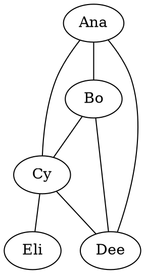
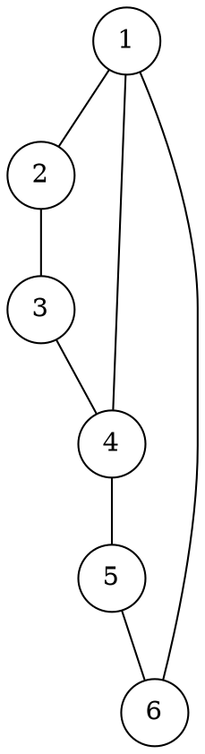

# Layout engines

The dot engine draws layers. The neato and circo engines draw networks. Write the engine in a comment on the first line.

```dot
// engine: neato
graph Team {
  Ana -- Bo -- Cy -- Dee -- Ana;
  Ana -- Cy;
  Bo -- Dee;
  Cy -- Eli;
}
```

```dot
// engine: circo
graph Ring {
  node [shape=circle];
  1 -- 2 -- 3 -- 4 -- 5 -- 6 -- 1;
  1 -- 4;
}
```
