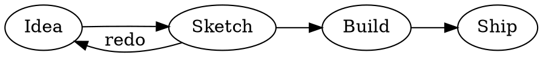
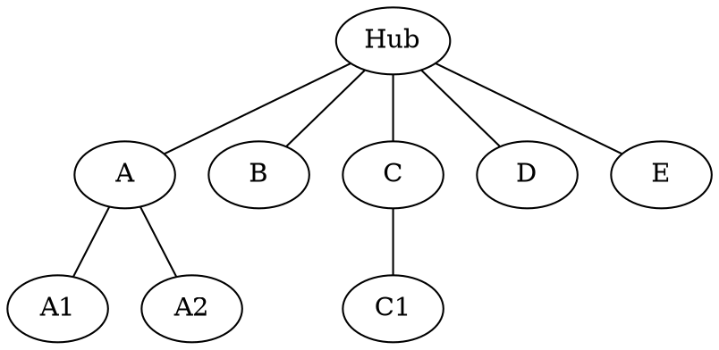

# Style presets and more engines

Pro. A comment line picks a preset. The presets are clean, blueprint, mono, pastel and contrast.

```dot
// preset: blueprint
digraph Plan {
  rankdir=LR;
  Idea -> Sketch -> Build -> Ship;
  Sketch -> Idea [label="redo"];
}
```

```dot
// engine: twopi
// preset: pastel
graph Hub {
  Hub -- A; Hub -- B; Hub -- C; Hub -- D; Hub -- E;
  A -- A1; A -- A2; C -- C1;
}
```
