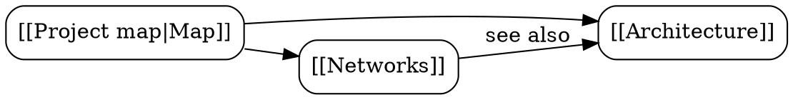

# Project map

Pro. Each node that is a wikilink opens its note. Select Architecture, then Networks.

```dot
digraph Map {
  rankdir=LR;
  node [shape=box style=rounded];
  "[[Project map|Map]]" -> "[[Architecture]]";
  "[[Project map|Map]]" -> "[[Networks]]";
  "[[Networks]]" -> "[[Architecture]]" [label="see also"];
}
```

A node can also take a link in its label: `a [label="Read [[Syntax error]]"]`.
