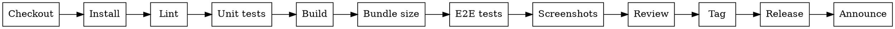

# Width and alignment

A wide pipeline at its natural size. Scroll the block to see the rest.

```dot
// width: natural
digraph Pipeline {
  rankdir=LR;
  node [shape=box];
  Checkout -> Install -> Lint -> "Unit tests" -> Build -> "Bundle size" -> "E2E tests" -> Screenshots -> Review -> Tag -> Release -> Announce;
}
```

A small graph at 40% of the note width, on the left.

```dot
// width: 40%
// align: left
digraph Status {
  rankdir=LR;
  node [shape=box, style=rounded];
  Draft -> Review -> Done;
  Review -> Draft [label="changes"];
}
```
